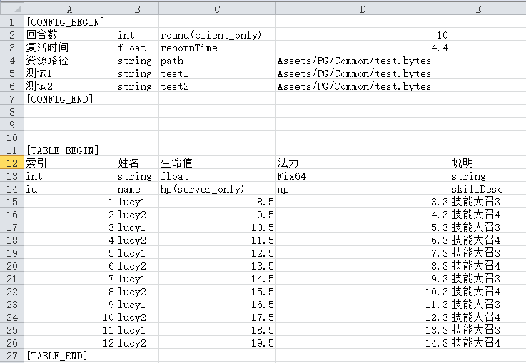

# excel2json 修改版

原版链接：[https://neil3d.github.io/coding/excel2json.html](https://neil3d.github.io/coding/excel2json.html)

windows二进制版本发布在 `publish` 文件夹下

## 命令行参数

* -i, --input Required. 输入的Excel文件路径.
* -j, --json 指定输出的json文件夹.
* -x, --xml 指定输出的xml文件夹.
* -p, --csharp 指定输出C#结构体文件夹
* -t, --tags 指定导出特定的标签, 标签用于给特定的列分类, 格式: `name(tag)`, 默认没有标签的列会全部导出




## 示例

```shell
excel2json.exe -i bull_fight_cfg.xlsl
               -j json_output/      # 导出 json 文件到文件夹 json_output
               -x xml_output/       # 导出 xml 文件到文件夹 xml_output
               -p csharp_output/    # 导出 csharp 定义文件到文件夹 csharp_output
               
excel2json.exe -i bull_fight_cfg.xlsl
               -j json_output/      # 导出 json 文件到文件夹 json_output
               -t client_only       # 导出包含 client_only 的标签列
               
excel2json.exe -i bull_fight_cfg.xlsl
               -x xml_output/       # 导出 xml 文件到文件夹 xml_output
               -t server_only       # 导出包含 server_only 的标签列

excel2json.exe -i bull_fight_cfg.xlsl
               -j json_output/      # 导出 json 文件到文件夹 json_output
               -t tag1,tag2         # 导出包含 tag1 与 tag2 的标签列, 注意逗号','中间不能有空格
```

