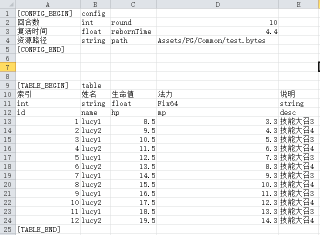
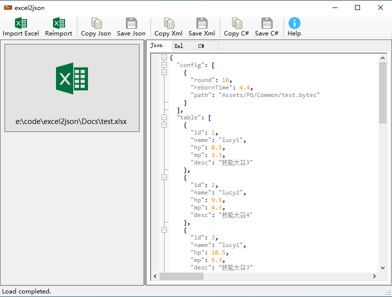
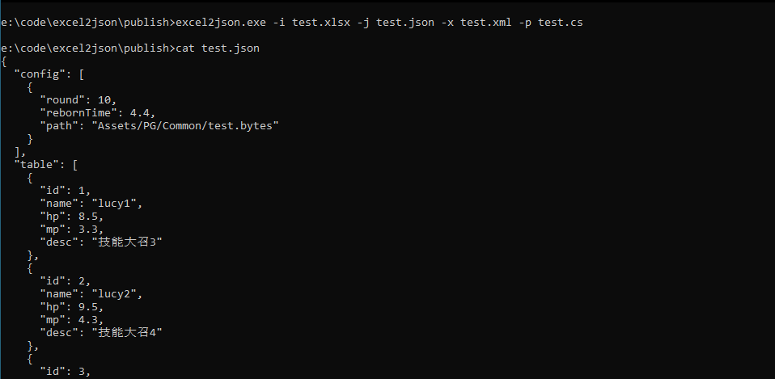

# excel2json 修改版

原版链接：[https://neil3d.github.io/coding/excel2json.html](https://neil3d.github.io/coding/excel2json.html)

windows二进制版本发布在 `publish` 文件夹下

## 命令行参数

* -i, --input Required. 输入的Excel文件路径.
* -j, --json 指定输出的json文件路径.
* -x, --xml 指定输出的xml文件路径.
* -p, --csharp 指定输出C#结构体文件路径.

