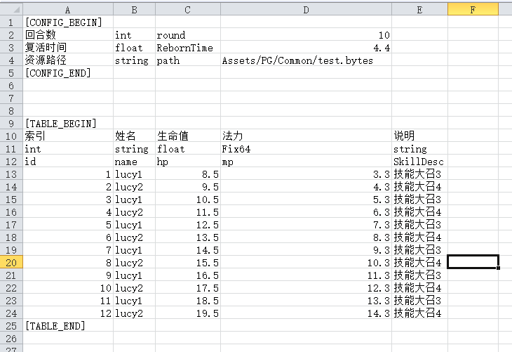
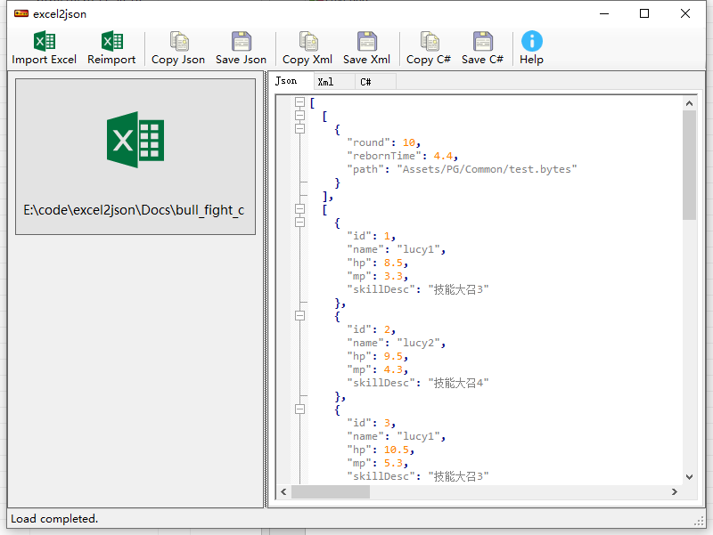

# excel2json 修改版

原版链接：[https://neil3d.github.io/coding/excel2json.html](https://neil3d.github.io/coding/excel2json.html)

windows二进制版本发布在 `publish` 文件夹下

## 命令行参数

* -i, --input Required. 输入的Excel文件路径.
* -j, --json 指定输出的json文件夹.
* -x, --xml 指定输出的xml文件夹.
* -p, --csharp 指定输出C#结构体文件夹.





```shell
excel2json.exe -i bull_fight_cfg.xlsl -j json_output/ -x xml_output/ -p csharp_output/

cat json_output/bull_fight_cfg.json

[
  [
    {
      "round": 10,
      "rebornTime": 4.4,
      "path": "Assets/PG/Common/test.bytes"
    }
  ],
  [
    {
      "id": 1,
      "name": "lucy1",
      "hp": 8.5,
      "mp": 3.3,
      "skillDesc": "技能大召3"
    },
    {
      "id": 2,
      "name": "lucy2",
      "hp": 9.5,
      "mp": 4.3,
      "skillDesc": "技能大召4"
    },
    ...
```

